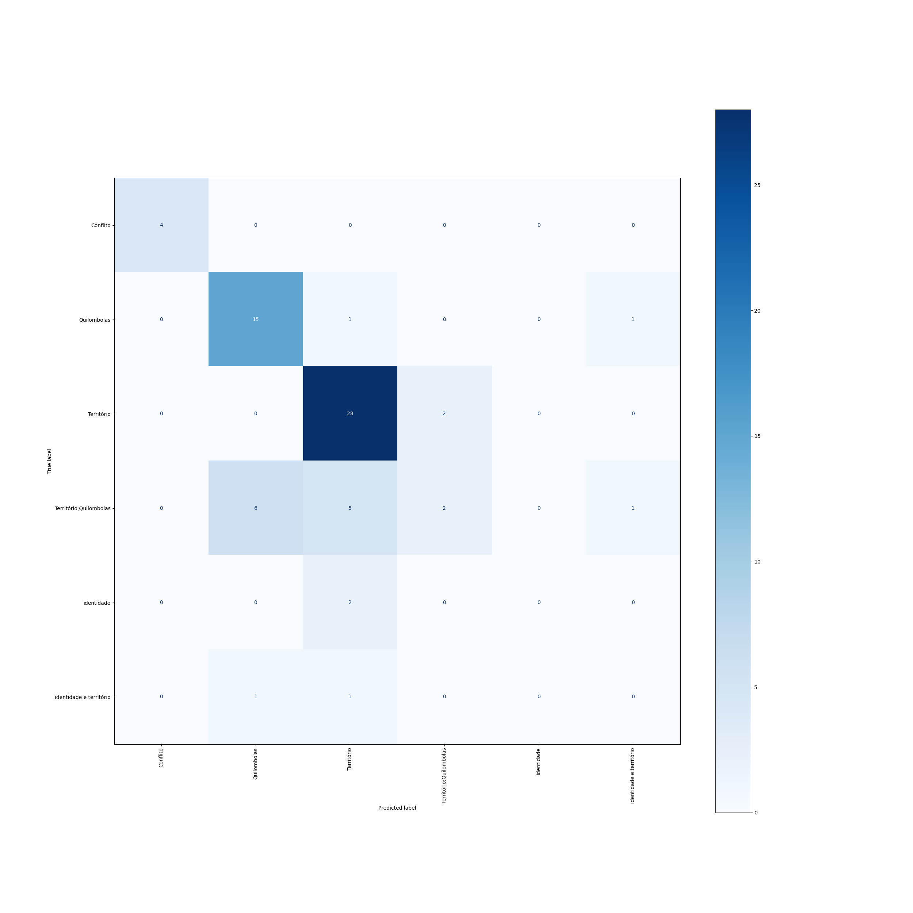

## Dados
**Localização**
`./Data/training_data/df_v1.parquet.gzip`

**Distribuição**
|classe|treino|teste|global|
|---:|---:|---:|---:|
|Território|119(45%)|29(44%)|148|
|Quilombolas|65(25%)|16(24%)|81|
|Território;Quilombolas|56(21%)|14(21%)|70|
|Conflito|15(6%)|4(6%)|19|
|identidade e território|6(2%)|2(3%)|8|
|identidade|3(1%)|1(2%)|4|
|6|264|66|330|

## Desempenho
|class|precision|recall|f1-score|support|
|---:|---:|---:|---:|---:|
|Conflito|1.00|0.75|0.86|4|
|Quilombolas|0.72|0.81|0.76|16|
|Território|0.71|0.93|0.81|29|
|Território;Quilombolas|0.40|0.14|0.21|14|
|identidade|0.00|0.00|0.00|1|
|identidade e território|1.00|1.00|1.00|2|
|||||
|accuracy|||0.71|
|macro avg|0.64|0.61|0.61|66|
|weighted avg|0.66|0.71|0.67|66|

