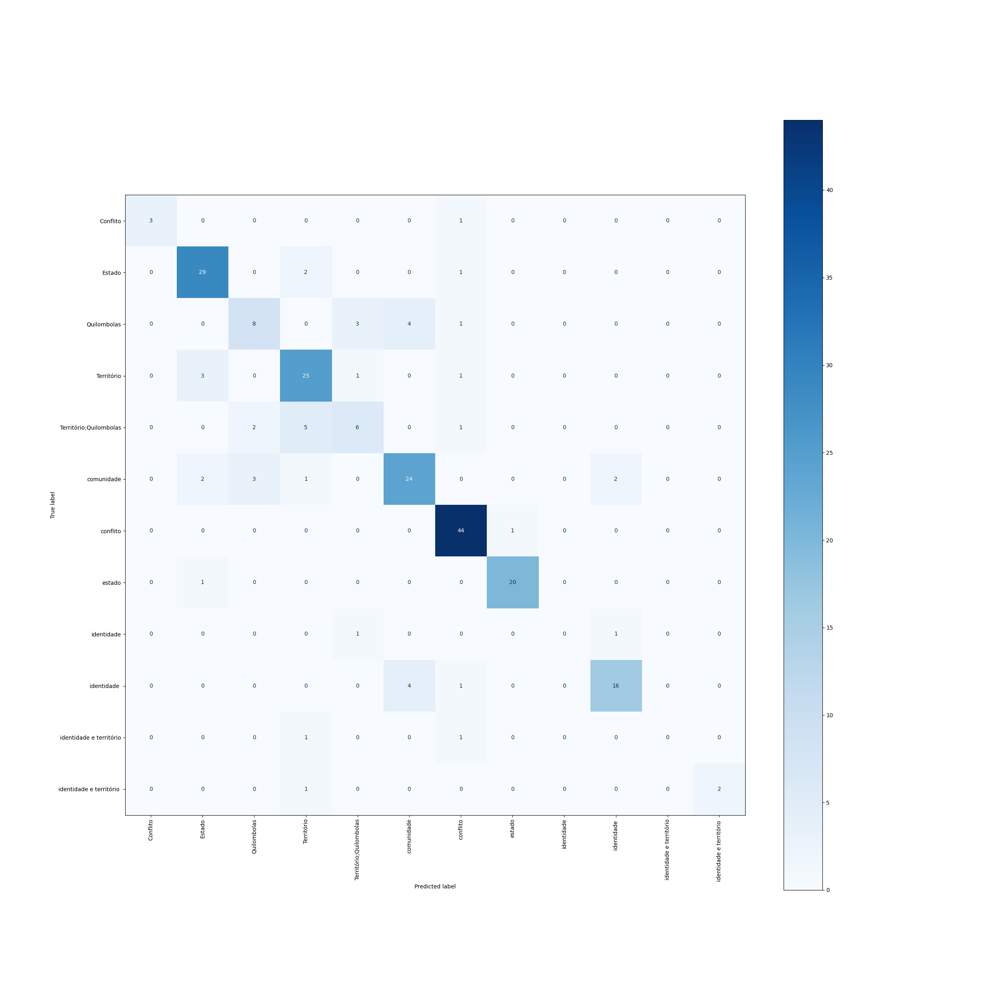

## Dados
**Localização**
`./Data/training_data/df_v3.parquet.gzip`

**Distribuição**
|classe|treino|teste|global|
|---:|---:|---:|---:|
|Território|118(43%)|30(43%)|148|
|Quilombolas|65(24%)|17(25%)|82|
|Território;Quilombolas|56(20%)|14(20%)|70|
|Conflito|15(5%)|4(6%)|19|
|identidade|10(4%)|2(3%)|12|
|identidade e território|10(4%)|2(3%)|12|
|6|274|69|343|

## Desempenho
|class|precision|recall|f1-score|support|
|---:|---:|---:|---:|---:|
|Conflito|1.00|1.00|1.00|4|
|Quilombolas|0.68|0.88|0.77|17|
|Território|0.76|0.93|0.84|30|
|Território;Quilombolas|0.50|0.14|0.22|14|
|identidade|0.00|0.00|0.00|2|
|identidade e território|0.00|0.00|0.00|2|
|||||
|accuracy|||0.71|
|macro avg|0.49|0.49|0.47|69|
|weighted avg|0.66|0.71|0.66|69|

